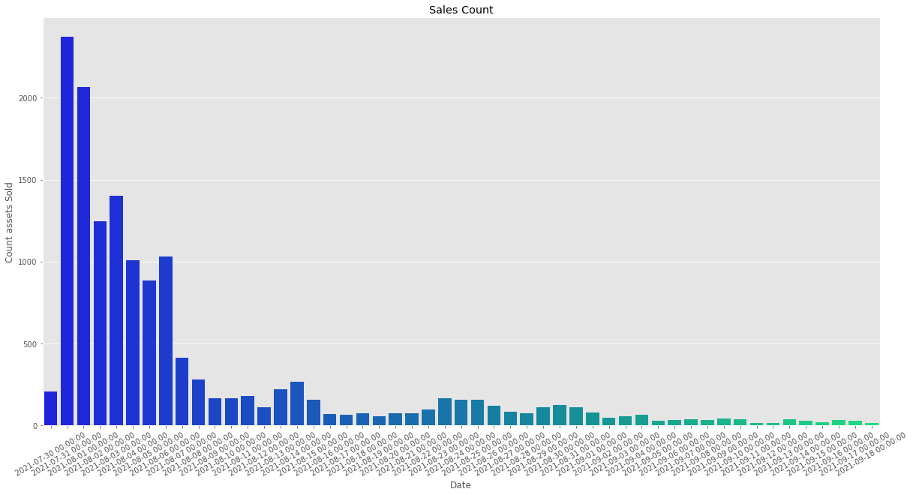
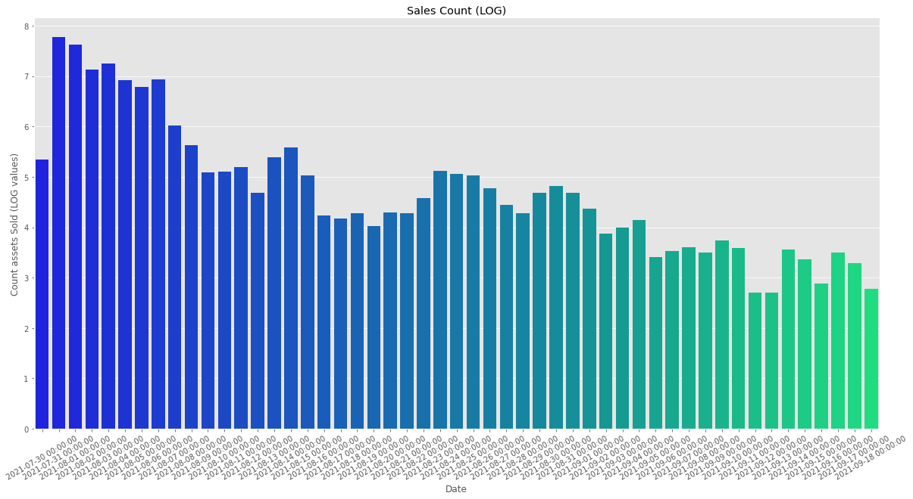
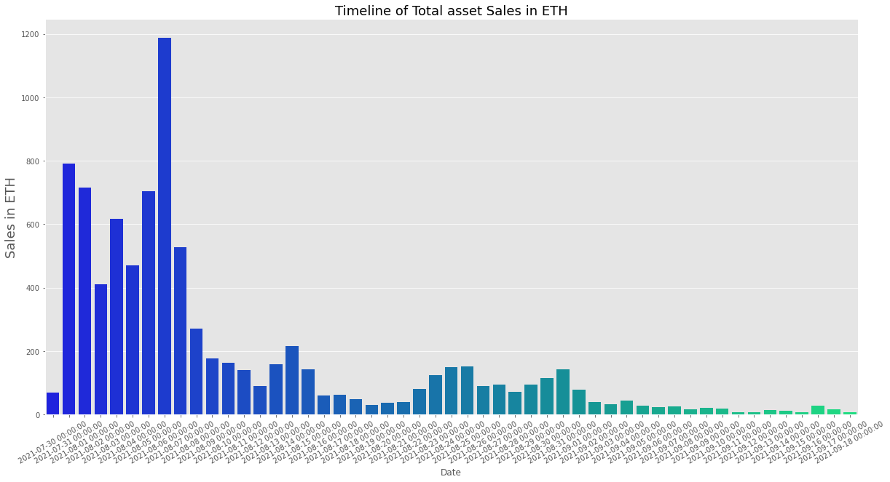
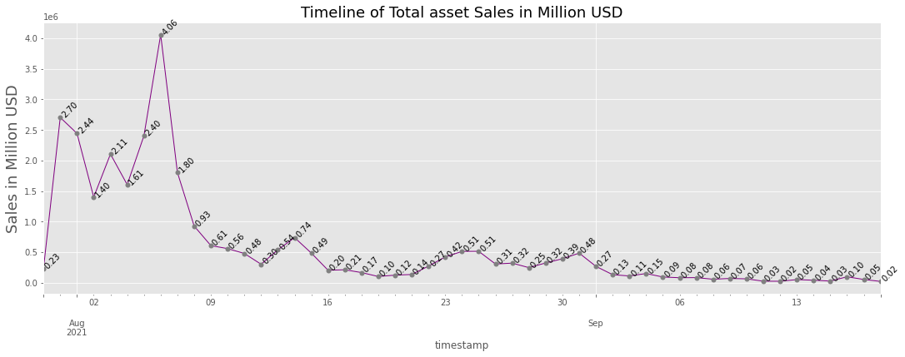
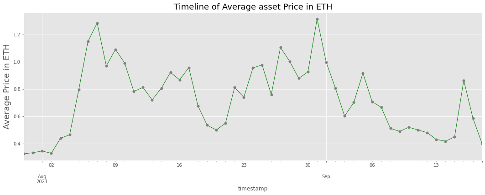
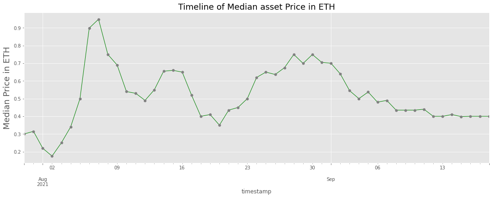
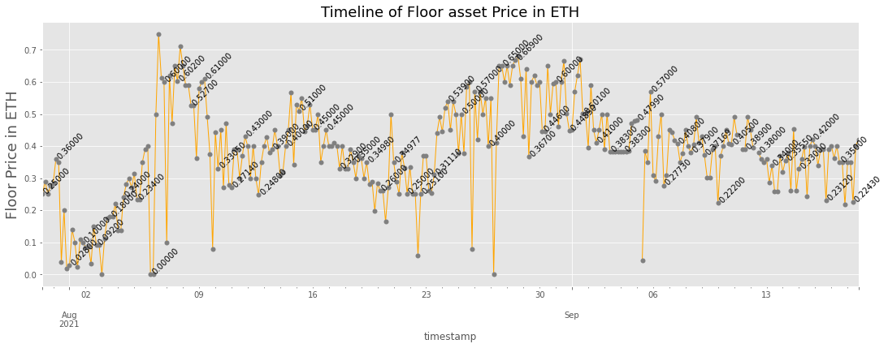
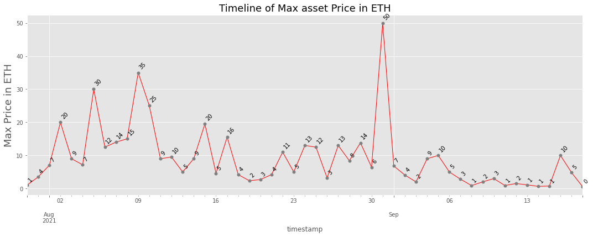
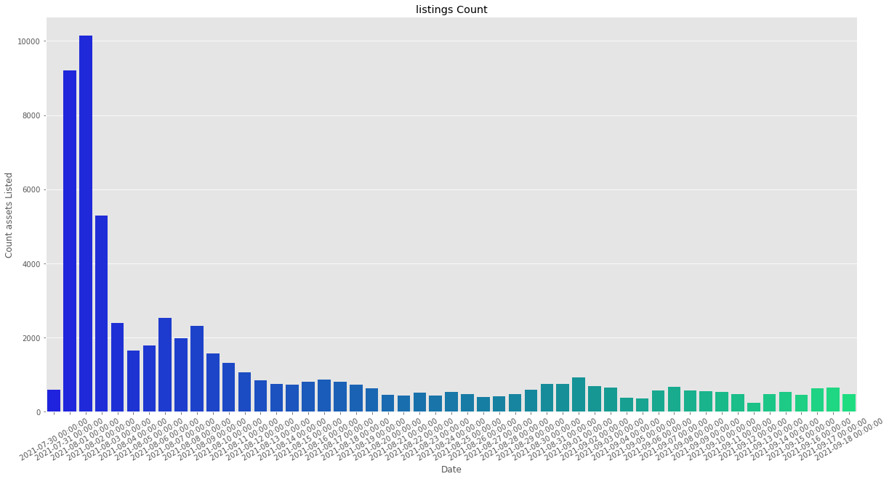

# How to Pull Data on NFT's, Their Sales, and Visualize Them
# NFT Data Science pt. 1 - Intro to OpenSea API

##### *By Alex Duffy elaborating on Adil Moujahid's framework* 

Cryptocurrency is digital native currency, or currency made for and on a digital medium / the internet). In a similar vein, non-fungible tokens (NFT’s) are digital native THINGS that you can buy with said currency and own. THINGS that you hold in your secure wallet, THINGS can be read and interacted with by any website that you give permission to, THINGS that can often be bought sold and traded.

OpenSea is the first and largest NFT marketplace created in June 2018. During that month 26 NFT’s were sold for just under \$$ 600 combined. Last month as of writing this (August 2021) 1.6 million NFT’s sold for \$ 3.4 billion USD; more than all previous months combined. That may have been a fluke and NFT’s may be a fad, or it could be a great time to learn more, look at popular collections, and analyze their trends.


*Analytics dashboard on OpenSea made by user rchen8* - https://dune.xyz/rchen8/opensea 

As an example I will be investigating the NFT collection Animetas, one that I am particularly interested in along with the Savage Droids collection which will be explored in part 2. 

As you follow along, you can change the collection this notebook pulls data for. All you have to do is replace 'asset_contract_address' with the smart contract address of your choice. This address can be found through OpenSea

*Note: You will have to change the start and and dates as well for data pulling. The initial query could take some time and require additional sleep time between loops to not throttle but once pulled and saved you can set dates to only query new data. That way you would only need to load saved data greatly reducing wait time for getting the most updated info.* 


### Notebook Functionalities:
* [Pull and Save NFT Data](#get-nft)
* [Pull and Save NFT Sales](#get-sales)
* [Pull and Save NFT Listings](#get-listings)
* [Load and Pre-Process Data](#load)
* [Basic Analysis](#analysis)
* [Macro Visualization](#visual)


```python
asset_contract_address = "0x18Df6C571F6fE9283B87f910E41dc5c8b77b7da5"
```


```python
%matplotlib inline
```


```python
from helpers import parse_events_data, parse_assets_data, parse_sale_data, parse_listing_data

import requests
import pandas as pd
from pandas_profiling import ProfileReport
import pickle

from statistics import *
import numpy as np
from scipy.stats import combine_pvalues

import matplotlib
import matplotlib.pyplot as plt
import seaborn as sns
plt.style.use('ggplot')

import time
from datetime import date, timedelta, datetime

import os
import glob
```

### Simple demo of the OpenSea API
#### Shows all information possible from Assets and Events without pre-processing

Here we demonstrate how to requests information from the OpenSea API and what data comes in that response for Assets and Events.

- Assets are the NFT's themselves, e.g. Droid B-6763 pictured above
- Events are transactions of NFT's, e.g. sales, listings, bids entered, bids withdrawn, etc. 

#### Assets 


```python
url = "https://api.opensea.io/api/v1/assets"

querystring = {"token_ids":list(range(0, 30)),
               "asset_contract_address":asset_contract_address,
               "order_direction":"desc",
               "offset":"0",
               "limit":"30"}
response = requests.request("GET", url, params=querystring)


# Getting asset data
assets = response.json()['assets']
if assets == []:
    print('empty')
```


```python
sample_asset = pd.DataFrame.from_dict(assets[0], orient='index')
sample_asset
```


<div>
<style scoped>
    .dataframe tbody tr th:only-of-type {
        vertical-align: middle;
    }

    .dataframe tbody tr th {
        vertical-align: top;
    }

    .dataframe thead th {
        text-align: right;
    }
</style>
<table border="1" class="dataframe">
  <thead>
    <tr style="text-align: right;">
      <th></th>
      <th>0</th>
    </tr>
  </thead>
  <tbody>
    <tr>
      <th>id</th>
      <td>33619906</td>
    </tr>
    <tr>
      <th>token_id</th>
      <td>26</td>
    </tr>
    <tr>
      <th>num_sales</th>
      <td>0</td>
    </tr>
    <tr>
      <th>background_color</th>
      <td>None</td>
    </tr>
    <tr>
      <th>image_url</th>
      <td>https://lh3.googleusercontent.com/SEpYcwGMcQo6...</td>
    </tr>
    <tr>
      <th>image_preview_url</th>
      <td>https://lh3.googleusercontent.com/SEpYcwGMcQo6...</td>
    </tr>
    <tr>
      <th>image_thumbnail_url</th>
      <td>https://lh3.googleusercontent.com/SEpYcwGMcQo6...</td>
    </tr>
    <tr>
      <th>image_original_url</th>
      <td>https://gateway.pinata.cloud/ipfs/QmbfuMdX9qiM...</td>
    </tr>
    <tr>
      <th>animation_url</th>
      <td>None</td>
    </tr>
    <tr>
      <th>animation_original_url</th>
      <td>None</td>
    </tr>
    <tr>
      <th>name</th>
      <td>Animeta #26</td>
    </tr>
    <tr>
      <th>description</th>
      <td>Animetas is a generative collection of 10101 u...</td>
    </tr>
    <tr>
      <th>external_link</th>
      <td>None</td>
    </tr>
    <tr>
      <th>asset_contract</th>
      <td>{'address': '0x18df6c571f6fe9283b87f910e41dc5c...</td>
    </tr>
    <tr>
      <th>permalink</th>
      <td>https://opensea.io/assets/0x18df6c571f6fe9283b...</td>
    </tr>
    <tr>
      <th>collection</th>
      <td>{'banner_image_url': 'https://lh3.googleuserco...</td>
    </tr>
    <tr>
      <th>decimals</th>
      <td>0</td>
    </tr>
    <tr>
      <th>token_metadata</th>
      <td>https://ipfs.io/ipfs/QmQobwx36WXzNNWmFVvwNe4Pg...</td>
    </tr>
    <tr>
      <th>owner</th>
      <td>{'user': {'username': 'joepayne'}, 'profile_im...</td>
    </tr>
    <tr>
      <th>sell_orders</th>
      <td>None</td>
    </tr>
    <tr>
      <th>creator</th>
      <td>{'user': {'username': 'Animetas_Vault'}, 'prof...</td>
    </tr>
    <tr>
      <th>traits</th>
      <td>[{'trait_type': 'print', 'value': 'cat', 'disp...</td>
    </tr>
    <tr>
      <th>last_sale</th>
      <td>None</td>
    </tr>
    <tr>
      <th>top_bid</th>
      <td>None</td>
    </tr>
    <tr>
      <th>listing_date</th>
      <td>None</td>
    </tr>
    <tr>
      <th>is_presale</th>
      <td>False</td>
    </tr>
    <tr>
      <th>transfer_fee_payment_token</th>
      <td>None</td>
    </tr>
    <tr>
      <th>transfer_fee</th>
      <td>None</td>
    </tr>
  </tbody>
</table>
</div>


#### Events


```python
url = "https://api.opensea.io/api/v1/events"

querystring = {"asset_contract_address":asset_contract_address,
               "event_type":"successful",
               "only_opensea":"true",
               "offset":0,
               "limit":"300"}
headers = {"Accept": "application/json"}

response = requests.request("GET", url, headers=headers, params=querystring)

# Getting event data
events = response.json()['asset_events']
if events == []:
    print('empty')
```


```python
sample_event = pd.DataFrame.from_dict(assets[0], orient='index')
sample_event
```


<div>
<style scoped>
    .dataframe tbody tr th:only-of-type {
        vertical-align: middle;
    }

    .dataframe tbody tr th {
        vertical-align: top;
    }

    .dataframe thead th {
        text-align: right;
    }
</style>
<table border="1" class="dataframe">
  <thead>
    <tr style="text-align: right;">
      <th></th>
      <th>0</th>
    </tr>
  </thead>
  <tbody>
    <tr>
      <th>id</th>
      <td>33619906</td>
    </tr>
    <tr>
      <th>token_id</th>
      <td>26</td>
    </tr>
    <tr>
      <th>num_sales</th>
      <td>0</td>
    </tr>
    <tr>
      <th>background_color</th>
      <td>None</td>
    </tr>
    <tr>
      <th>image_url</th>
      <td>https://lh3.googleusercontent.com/SEpYcwGMcQo6...</td>
    </tr>
    <tr>
      <th>image_preview_url</th>
      <td>https://lh3.googleusercontent.com/SEpYcwGMcQo6...</td>
    </tr>
    <tr>
      <th>image_thumbnail_url</th>
      <td>https://lh3.googleusercontent.com/SEpYcwGMcQo6...</td>
    </tr>
    <tr>
      <th>image_original_url</th>
      <td>https://gateway.pinata.cloud/ipfs/QmbfuMdX9qiM...</td>
    </tr>
    <tr>
      <th>animation_url</th>
      <td>None</td>
    </tr>
    <tr>
      <th>animation_original_url</th>
      <td>None</td>
    </tr>
    <tr>
      <th>name</th>
      <td>Animeta #26</td>
    </tr>
    <tr>
      <th>description</th>
      <td>Animetas is a generative collection of 10101 u...</td>
    </tr>
    <tr>
      <th>external_link</th>
      <td>None</td>
    </tr>
    <tr>
      <th>asset_contract</th>
      <td>{'address': '0x18df6c571f6fe9283b87f910e41dc5c...</td>
    </tr>
    <tr>
      <th>permalink</th>
      <td>https://opensea.io/assets/0x18df6c571f6fe9283b...</td>
    </tr>
    <tr>
      <th>collection</th>
      <td>{'banner_image_url': 'https://lh3.googleuserco...</td>
    </tr>
    <tr>
      <th>decimals</th>
      <td>0</td>
    </tr>
    <tr>
      <th>token_metadata</th>
      <td>https://ipfs.io/ipfs/QmQobwx36WXzNNWmFVvwNe4Pg...</td>
    </tr>
    <tr>
      <th>owner</th>
      <td>{'user': {'username': 'joepayne'}, 'profile_im...</td>
    </tr>
    <tr>
      <th>sell_orders</th>
      <td>None</td>
    </tr>
    <tr>
      <th>creator</th>
      <td>{'user': {'username': 'Animetas_Vault'}, 'prof...</td>
    </tr>
    <tr>
      <th>traits</th>
      <td>[{'trait_type': 'print', 'value': 'cat', 'disp...</td>
    </tr>
    <tr>
      <th>last_sale</th>
      <td>None</td>
    </tr>
    <tr>
      <th>top_bid</th>
      <td>None</td>
    </tr>
    <tr>
      <th>listing_date</th>
      <td>None</td>
    </tr>
    <tr>
      <th>is_presale</th>
      <td>False</td>
    </tr>
    <tr>
      <th>transfer_fee_payment_token</th>
      <td>None</td>
    </tr>
    <tr>
      <th>transfer_fee</th>
      <td>None</td>
    </tr>
  </tbody>
</table>
</div>


## Pull and Save NFT Data <a class="anchor" id="get-nft"></a>

#### Getting Assets Data

The code below collects assets data about all the assets. The API has a limit of 50 items per call and a max offset of 10,000. In order to circumvent this we increment token id instead of offest which leaves room for bugs if the tokens are not numbered in ascending order. We also need to be aware if the first token has the ID 0 or the ID of 1. 

We use the parsing provided in Adil Moujahid's framework to focus on these fields for each asset: 

##### Asset Data Parsed:
- 'asset_id'
- 'creator_username'
- 'creator_address'
- 'owner_username'
- 'owner_address'
- 'traits'
- 'num_sales'

We also need to store this data somehow to be able to read from it locally instead of having to do the lengthy request every time we want to update our visuals. 

One option is using pickle to save dataframes and lists. While convenient, it is not memory efficient. One option which we explore in part two is saving arrays as .npz files. Another alternative altogether suited for a more production ready environment would be feeding that data into a postgres SQL database. 


```python
def download_asset_info(save_location):
    if not os.path.isdir(save_location):
        os.makedirs(save_location)
    url = "https://api.opensea.io/api/v1/assets"
    listoassets = []

    for i in range(0, 3000):
        querystring = {"token_ids":list(range((i*30), (i*30)+30)),
                       "asset_contract_address":asset_contract_address,
                       "order_direction":"desc",
                       "offset":"0",
                       "limit":"30"}
        response = requests.request("GET", url, params=querystring)

        print(i, end=" ")
        if response.status_code != 200:
            print('error')
            print(response.json())
            break

        # Getting assets data
        assets = response.json()['assets']
        if assets == []:
            break
        # Parsing assets data
        parsed_assets = [parse_assets_data(asset) for asset in assets]
        # storing parsed events data into list
        listoassets.append(parsed_assets)
    
    # Flatten everything into one list
    listoassets = [item for sublist in listoassets for item in sublist]
    # Convert to df
    assets_df = pd.DataFrame(listoassets)
    
    with open(save_location + 'assets_df'+str(date.today())+r'.pkl', 'wb') as f:
        pickle.dump(assets_df, f)
```

## Pull and Save NFT Sales <a class="anchor" id="get-sales"></a>


#### Getting sales transactions data

The code below collects all sale transactions data. 
The API has a limit of 300 items per call and 10,000 items total / response. 
Days with > 10,000 sales will require chunking (built in but you need to specify what hour chunks you want to chunk in) but most projects aren't there yet. With that said in the NFT world there are often days where interest in a project can rapidly spike occasionally breaking that 10,000 item limit. 

##### Sales Data Parsed
- 'is_bundle'
- 'event_id'
- 'seller_address'
- 'buyer_address'
- 'buyer_username'
- 'seller_username'
- 'timestamp'
- 'total_price'
- 'payment_token'
- 'usd_price'
- 'transaction_hash'


```python
# Download sales info from start_date to end _date and save them all into their own day's files
# Default values 07/30/21 to today
def download_sales_info(save_location, start_date = date(2021, 7, 30), end_date = date.today()):
    if not os.path.isdir(save_location):
        os.makedirs(save_location)
    url = "https://api.opensea.io/api/v1/events"
    # get the number of days that we want to download and save sales for
    delta = end_date - start_date
    count_days = int(delta.days)
    
    for i in range(count_days+1):
        sales_that_day = []
        # set start and end of the day we are checking, if it's today set end to current time
        if date.today() == (start_date + timedelta(days=i)):
            before = datetime.now()
            after = datetime.combine((start_date + timedelta(days=i)), datetime.min.time())
        else:
            before = datetime.combine((start_date + timedelta(days=i+1)), datetime.min.time())
            after = datetime.combine((start_date + timedelta(days=i)), datetime.min.time())
        # There are too many transactions, now have to break them up by chunks in the day
        hour_chunks = 24
        chunk_count = 24/hour_chunks
        time.sleep(.5)

        for chunk in range(int(chunk_count)):
            end = False
            for j in range(0, 35):
                time.sleep(.5)
                # add the hour_chunk to the start of the day (after) time for each chunk
                # use the actual before if we pass it chronologically though
                changed_before = after + timedelta(hours=hour_chunks*(chunk+1)) - timedelta(minutes = 1)
                changed_after = after + timedelta(hours = hour_chunks*(chunk))
                
                # this should only happen on the last chunk of a split day or if on current day
                if before < changed_before:
                    changed_before = before
                    end = True

                querystring = {"asset_contract_address":asset_contract_address,
                               "event_type":"successful",
                               "only_opensea":"true",
                               "offset":j*300,
                               "occurred_before":changed_before,
                               "occurred_after":changed_after,
                               "limit":"300"}
                headers = {"Accept": "application/json"}

                response = requests.request("GET", url, headers=headers, params=querystring)


                print(j, end=" ")
                if response.status_code != 200:
                    print('error')
                    print(response.json())
                    break

                #Getting assets sales data
                event_sales = response.json()['asset_events']

                if event_sales == []:
                    end =True
                    break

                # Parsing asset sales data
                parsed_event_sales = [parse_sale_data(sale) for sale in event_sales]
                # storing parsed events data into list
                sales_that_day.append(parsed_event_sales)
                # check if the last date in the list is the same day as 
                last_date = (datetime.strptime(parsed_event_sales[0]['timestamp'], '%Y-%m-%dT%H:%M:%S'))
                print(last_date)
            if end:
                break
        sales_that_day = [item for sublist in sales_that_day for item in sublist]
        
        print(str(len(sales_that_day))+ " sales saved to" + save_location + "events_sales_list_" + str(start_date + timedelta(days=i))+'.pkl')
        with open(save_location + "events_sales_list_" + str(start_date + timedelta(days=i))+'.pkl', 'wb') as f:
            pickle.dump(sales_that_day, f)

```

## Pull and Save NFT Listings <a class="anchor" id="get-listings"></a>


#### Getting assets listings transactions data

There are other events than just sales. 
There are listings, bids entered, bids withdrawn, listings cancelled, etc.
To change which you are requesting you change the 'event_type' modifier. 
You can see the different event types and other information about the API here: https://docs.opensea.io/reference/retrieving-asset-events


##### Listing Data Parsed:
- 'is_bundle'
- 'event_id'
- 'seller_address'
- 'seller_username'
- 'created_date'
- 'starting_price'
- 'payment_token'
- 'usd_price'


```python
# Download listings info from start_date to end _date and save them all into their own day's files
# Default values to first listing ever 7/30/21 to today
def download_listings_info(save_location, start_date = date(2021, 7, 30), end_date = date.today()):
    if not os.path.isdir(save_location):
        os.makedirs(save_location)
    url = "https://api.opensea.io/api/v1/events"
    # get the number of days that we want to download and save listings for
    delta = end_date - start_date
    count_days = int(delta.days)
    
    for i in range(count_days+1):
        listings_that_day = []
        # set start and end of the day we are checking, if it's today set end to current time
        if date.today() == (start_date + timedelta(days=i)):
            before = datetime.now()
            after = datetime.combine((start_date + timedelta(days=i)), datetime.min.time())
        else:
            before = datetime.combine((start_date + timedelta(days=i+1)), datetime.min.time())
            after = datetime.combine((start_date + timedelta(days=i)), datetime.min.time())
        # There are too many transactions, now have to break them up by chunks in the day
        hour_chunks = 24
        chunk_count = 24/hour_chunks
        time.sleep(.5)

        
        for chunk in range(int(chunk_count)):
            end = False
            for j in range(0, 35):
                time.sleep(.5)
                # add the hour_chunk to the start of the day (after) time for each chunk
                # use the actual before if we pass it chronologically though
                changed_before = after + timedelta(hours=hour_chunks*(chunk+1)) - timedelta(minutes = 1)
                changed_after = after + timedelta(hours = hour_chunks*(chunk))
                
                # this should only happen on the last chunk of a split day or if on current day
                if before < changed_before:
                    changed_before = before
                    end = True

                querystring = {"asset_contract_address":asset_contract_address,
                               "event_type":"created",
                               "only_opensea":"true",
                               "offset":j*300,
                               "occurred_before":changed_before,
                               "occurred_after":changed_after,
                               "limit":"300"}
                headers = {"Accept": "application/json"}

                response = requests.request("GET", url, headers=headers, params=querystring)


                print(j, end=" ")
                if response.status_code != 200:
                    print('error')
                    print(response.json())
                    break

                #Getting assets listings data
                event_listings = response.json()['asset_events']

                if event_listings == []:
                    end = True
                    break

                # Parsing events listings data
                parsed_event_listings = [parse_listing_data(listing) for listing in event_listings]
                # storing parsed events data into list
                listings_that_day.append(parsed_event_listings)
                # check if the last date in the list is the same day as 
                print(parsed_event_listings[0]['created_date'])
            if end:
                break
        listings_that_day = [item for sublist in listings_that_day for item in sublist]
        
        print(str(len(listings_that_day))+ " listings saved to" + save_location +
              "events_listings_list_" + str(start_date + timedelta(days=i))+'.pkl')
        with open(save_location + "events_listings_list_" + str(start_date + timedelta(days=i))+'.pkl', 'wb') as f:
            pickle.dump(listings_that_day, f)
```

#### Each of the download files saves a pickled list / DF  of their information which can be loaded below for analysis
Sales and Listings downloads support start_date and end_date to avoid taking extra time to download data more than once! 
We print out information about how many assets and events are being downloaded.
We also print any error messages in case there are errors with throttling or other limitations of the OpenSea API.


```python
# Change location to suit your own needs
save_location = "./static/animetas/"

# assets
download_asset_info(save_location)

# SALES
# download sales info from start_date to end_date e.g. date(2021, 7, 30), date.today() - timedelta(days=1), etc.
# defaults to first day of sales to today

download_sales_info(save_location = save_location, start_date = date(2021,7,30))

# LISTINGS
# download listings info from start_date to end_date e.g. date(2021, 7, 30), date.today() - timedelta(days=1), etc.
# defaults to first day of listings to today

download_listings_info(save_location = save_location, start_date = date(2021,7,30))
```

    0 1 2 3 4 5 6 7 8 9 10 11 12 13 14 15 16 17 18 19 20 21 22 23 24 25 26 27 28 29 30 31 32 33 34 35 36 37 38 39 40 41 42 43 44 45 46 47 48 49 50 51 52 53 54 55 56 57 58 59 60 61 62 63 64 65 66 67 68 69 70 71 72 73 74 75 76 77 78 79 80 81 82 83 84 85 86 87 88 89 90 91 92 93 94 95 96 97 98 99 100 101 102 103 104 105 106 107 108 109 110 111 112 113 114 115 116 117 118 119 120 121 122 123 124 125 126 127 128 129 130 131 132 133 134 135 136 137 138 139 140 141 142 143 144 145 146 147 148 149 150 151 152 153 154 155 156 157 158 159 160 161 162 163 164 165 166 167 168 169 170 171 172 173 174 175 176 177 178 179 180 181 182 183 184 185 186 187 188 189 190 191 192 193 194 195 196 197 198 199 200 201 202 203 204 205 206 207 208 209 210 211 212 213 214 215 216 217 218 219 220 221 222 223 224 225 226 227 228 229 230 231 232 233 234 235 236 237 238 239 240 241 242 243 244 245 246 247 248 249 250 251 252 253 254 255 256 257 258 259 260 261 262 263 264 265 266 267 268 269 270 271 272 273 274 275 276 277 278 279 280 281 282 283 284 285 286 287 288 289 290 291 292 293 294 295 296 297 298 299 300 301 302 303 304 305 306 307 308 309 310 311 312 313 314 315 316 317 318 319 320 321 322 323 324 325 326 327 328 329 330 331 332 333 334 335 336 337 0 2021-07-30 23:53:54
    1 208 sales saved to./static/animetas/events_sales_list_2021-07-30.pkl
    0 2021-07-31 23:58:48
    1 2021-07-31 23:16:18
    2 2021-07-31 22:46:43
    3 2021-07-31 20:25:10
    4 2021-07-31 17:57:16
    5 2021-07-31 17:05:49
    6 2021-07-31 16:40:37
    7 2021-07-31 16:25:15
    8 2021-07-31 00:07:41
    9 2402 sales saved to./static/animetas/events_sales_list_2021-07-31.pkl
    0 2021-08-01 23:58:21
    1 2021-08-01 20:46:25
    2 2021-08-01 19:19:50
    3 2021-08-01 14:32:59
    4 2021-08-01 07:49:15
    5 2021-08-01 03:33:43
    6 2021-08-01 01:15:38
    7 2074 sales saved to./static/animetas/events_sales_list_2021-08-01.pkl
    0 2021-08-02 23:58:37
    1 2021-08-02 18:30:59
    2 2021-08-02 12:34:09
    3 2021-08-02 06:18:04
    4 2021-08-02 00:55:51
    5 1246 sales saved to./static/animetas/events_sales_list_2021-08-02.pkl
    0 2021-08-03 23:58:03
    1 2021-08-03 18:24:06
    2 2021-08-03 14:42:46
    3 2021-08-03 08:42:32
    4 2021-08-03 03:00:39
    5 1406 sales saved to./static/animetas/events_sales_list_2021-08-03.pkl
    0 2021-08-04 23:57:53
    1 2021-08-04 17:44:08
    2 2021-08-04 11:30:46
    3 2021-08-04 03:59:13
    4 1009 sales saved to./static/animetas/events_sales_list_2021-08-04.pkl
    0 2021-08-05 23:58:22
    1 2021-08-05 15:22:18
    2 2021-08-05 09:11:33
    3 884 sales saved to./static/animetas/events_sales_list_2021-08-05.pkl
    0 2021-08-06 23:48:51
    1 2021-08-06 14:14:55
    2 2021-08-06 09:19:54
    3 2021-08-06 04:14:17
    4 1035 sales saved to./static/animetas/events_sales_list_2021-08-06.pkl
    0 2021-08-07 23:55:39
    1 2021-08-07 07:45:34
    2 411 sales saved to./static/animetas/events_sales_list_2021-08-07.pkl
    0 2021-08-08 23:58:55
    1 282 sales saved to./static/animetas/events_sales_list_2021-08-08.pkl
    0 2021-08-09 23:51:26
    1 163 sales saved to./static/animetas/events_sales_list_2021-08-09.pkl
    0 2021-08-10 23:58:51
    1 165 sales saved to./static/animetas/events_sales_list_2021-08-10.pkl
    0 2021-08-11 23:53:26
    1 180 sales saved to./static/animetas/events_sales_list_2021-08-11.pkl
    0 2021-08-12 23:54:28
    1 109 sales saved to./static/animetas/events_sales_list_2021-08-12.pkl
    0 2021-08-13 23:58:20
    1 219 sales saved to./static/animetas/events_sales_list_2021-08-13.pkl
    0 2021-08-14 23:28:58
    1 268 sales saved to./static/animetas/events_sales_list_2021-08-14.pkl
    0 2021-08-15 23:39:20
    1 154 sales saved to./static/animetas/events_sales_list_2021-08-15.pkl
    0 2021-08-16 23:58:26
    1 69 sales saved to./static/animetas/events_sales_list_2021-08-16.pkl
    0 2021-08-17 23:56:11
    1 65 sales saved to./static/animetas/events_sales_list_2021-08-17.pkl
    0 2021-08-18 23:52:18
    1 72 sales saved to./static/animetas/events_sales_list_2021-08-18.pkl
    0 2021-08-19 23:34:56
    1 56 sales saved to./static/animetas/events_sales_list_2021-08-19.pkl
    0 2021-08-20 23:04:07
    1 73 sales saved to./static/animetas/events_sales_list_2021-08-20.pkl
    0 2021-08-21 23:50:54
    1 72 sales saved to./static/animetas/events_sales_list_2021-08-21.pkl
    0 2021-08-22 23:53:13
    1 98 sales saved to./static/animetas/events_sales_list_2021-08-22.pkl
    0 2021-08-23 23:52:43
    1 167 sales saved to./static/animetas/events_sales_list_2021-08-23.pkl
    0 2021-08-24 23:52:48
    1 157 sales saved to./static/animetas/events_sales_list_2021-08-24.pkl
    0 2021-08-25 23:53:35
    1 155 sales saved to./static/animetas/events_sales_list_2021-08-25.pkl
    0 2021-08-26 23:57:44
    1 118 sales saved to./static/animetas/events_sales_list_2021-08-26.pkl
    0 2021-08-27 22:40:35
    1 85 sales saved to./static/animetas/events_sales_list_2021-08-27.pkl
    0 2021-08-28 23:55:50
    1 72 sales saved to./static/animetas/events_sales_list_2021-08-28.pkl
    0 2021-08-29 23:54:15
    1 108 sales saved to./static/animetas/events_sales_list_2021-08-29.pkl
    0 2021-08-30 23:28:36
    1 124 sales saved to./static/animetas/events_sales_list_2021-08-30.pkl
    0 2021-08-31 23:37:32
    1 108 sales saved to./static/animetas/events_sales_list_2021-08-31.pkl
    0 2021-09-01 23:58:21
    1 80 sales saved to./static/animetas/events_sales_list_2021-09-01.pkl
    0 2021-09-02 23:34:16
    1 49 sales saved to./static/animetas/events_sales_list_2021-09-02.pkl
    0 2021-09-03 23:48:41
    1 54 sales saved to./static/animetas/events_sales_list_2021-09-03.pkl
    0 2021-09-04 23:06:16
    1 63 sales saved to./static/animetas/events_sales_list_2021-09-04.pkl
    0 2021-09-05 22:15:02
    1 30 sales saved to./static/animetas/events_sales_list_2021-09-05.pkl
    0 2021-09-06 23:10:12
    1 34 sales saved to./static/animetas/events_sales_list_2021-09-06.pkl
    0 2021-09-07 23:55:04
    1 37 sales saved to./static/animetas/events_sales_list_2021-09-07.pkl
    0 2021-09-08 23:40:49
    1 33 sales saved to./static/animetas/events_sales_list_2021-09-08.pkl
    0 2021-09-09 21:06:35
    1 42 sales saved to./static/animetas/events_sales_list_2021-09-09.pkl
    0 2021-09-10 23:38:58
    1 36 sales saved to./static/animetas/events_sales_list_2021-09-10.pkl
    0 2021-09-11 21:53:00
    1 15 sales saved to./static/animetas/events_sales_list_2021-09-11.pkl
    0 2021-09-12 21:45:47
    1 15 sales saved to./static/animetas/events_sales_list_2021-09-12.pkl
    0 2021-09-13 23:52:24
    1 35 sales saved to./static/animetas/events_sales_list_2021-09-13.pkl
    0 2021-09-14 21:53:57
    1 29 sales saved to./static/animetas/events_sales_list_2021-09-14.pkl
    0 2021-09-15 21:58:30
    1 18 sales saved to./static/animetas/events_sales_list_2021-09-15.pkl
    0 2021-09-16 23:00:38
    1 33 sales saved to./static/animetas/events_sales_list_2021-09-16.pkl
    0 2021-09-17 23:23:07
    1 27 sales saved to./static/animetas/events_sales_list_2021-09-17.pkl
    0 2021-09-18 18:05:11
    1 16 sales saved to./static/animetas/events_sales_list_2021-09-18.pkl
    0 2021-07-30T23:58:53.710235
    1 2021-07-30T16:20:57.245742
    2 585 listings saved to./static/animetas/events_listings_list_2021-07-30.pkl
    0 2021-07-31T23:58:58.123650
    1 2021-07-31T23:52:15.111110
    2 2021-07-31T23:45:31.086338
    3 2021-07-31T23:38:51.388399
    4 2021-07-31T23:33:21.053337
    5 2021-07-31T23:27:59.182295
    6 2021-07-31T23:23:30.456417
    7 2021-07-31T23:19:11.076039
    8 2021-07-31T23:15:04.008444
    9 2021-07-31T23:11:03.727700
    10 2021-07-31T23:07:48.696061
    11 2021-07-31T23:04:26.236027
    12 2021-07-31T23:01:12.138839
    13 2021-07-31T22:58:10.218460
    14 2021-07-31T22:54:58.415967
    15 2021-07-31T22:52:04.771594
    16 2021-07-31T22:48:22.831806
    17 2021-07-31T22:42:22.239504
    18 2021-07-31T21:14:17.999282
    19 2021-07-31T19:02:58.507187
    20 2021-07-31T17:42:22.310564
    21 2021-07-31T17:22:34.979755
    22 2021-07-31T17:09:15.682858
    23 2021-07-31T16:59:26.059875
    24 2021-07-31T16:50:59.221043
    25 2021-07-31T16:44:11.319561
    26 2021-07-31T16:37:53.696755
    27 2021-07-31T16:32:16.245629
    28 2021-07-31T16:27:23.547086
    29 2021-07-31T16:23:10.975968
    30 2021-07-31T16:12:27.621686
    31 2021-07-31T04:58:42.210409
    32 9436 listings saved to./static/animetas/events_listings_list_2021-07-31.pkl
    0 2021-08-01T23:58:50.305743
    1 2021-08-01T23:21:35.013876
    2 2021-08-01T22:48:32.943467
    3 2021-08-01T22:24:00.345418
    4 2021-08-01T22:04:00.853090
    5 2021-08-01T21:38:51.654973
    6 2021-08-01T21:20:36.189000
    7 2021-08-01T21:04:12.956086
    8 2021-08-01T20:50:56.648659
    9 2021-08-01T20:40:41.392252
    10 2021-08-01T20:30:09.315430
    11 2021-08-01T20:21:57.012412
    12 2021-08-01T20:14:40.136292
    13 2021-08-01T20:05:16.663407
    14 2021-08-01T19:44:56.662666
    15 2021-08-01T19:21:20.748362
    16 2021-08-01T18:04:01.728972
    17 2021-08-01T16:48:03.486206
    18 2021-08-01T15:13:22.231238
    19 2021-08-01T14:03:06.852987
    20 2021-08-01T12:21:24.120936
    21 2021-08-01T10:05:00.540720
    22 2021-08-01T08:22:23.372371
    23 2021-08-01T06:54:23.347213
    24 2021-08-01T05:21:04.958852
    25 2021-08-01T04:28:24.534787
    26 2021-08-01T03:38:19.522332
    27 2021-08-01T02:53:08.176902
    28 2021-08-01T02:23:35.317632
    29 2021-08-01T01:55:56.193229
    30 2021-08-01T01:34:22.094260
    31 2021-08-01T01:20:25.640843
    32 2021-08-01T01:06:50.860269
    33 2021-08-01T00:57:24.496003
    34 error
    {'offset': ['ensure this value is less than or equal to 10000']}
    10200 listings saved to./static/animetas/events_listings_list_2021-08-01.pkl
    0 2021-08-02T23:58:42.158530
    1 2021-08-02T21:27:05.420384
    2 2021-08-02T19:50:19.762151
    3 2021-08-02T18:30:09.155800
    4 2021-08-02T17:22:34.693013
    5 2021-08-02T16:25:05.955988
    6 2021-08-02T15:58:07.233710
    7 2021-08-02T14:39:28.940903
    8 2021-08-02T12:54:02.516071
    9 2021-08-02T09:48:40.848657
    10 2021-08-02T07:20:17.930045
    11 2021-08-02T05:35:43.911542
    12 2021-08-02T04:21:24.841636
    13 2021-08-02T02:42:34.893324
    14 2021-08-02T02:07:52.024097
    15 2021-08-02T01:50:21.694420
    16 2021-08-02T00:57:06.832246
    17 2021-08-02T00:33:39.622448
    18 5293 listings saved to./static/animetas/events_listings_list_2021-08-02.pkl
    0 2021-08-03T23:58:54.301149
    1 2021-08-03T21:01:39.078805
    2 2021-08-03T18:31:43.612613
    3 2021-08-03T16:13:09.027712
    4 2021-08-03T14:00:10.491476
    5 2021-08-03T10:59:00.926665
    6 2021-08-03T05:57:02.374349
    7 2021-08-03T03:03:19.368042
    8 2021-08-03T00:03:21.518569
    9 2407 listings saved to./static/animetas/events_listings_list_2021-08-03.pkl
    0 2021-08-04T23:56:14.439553
    1 2021-08-04T19:49:59.779273
    2 2021-08-04T16:21:12.987419
    3 2021-08-04T11:47:18.994124
    4 2021-08-04T05:54:42.866423
    5 2021-08-04T01:40:10.264267
    6 1648 listings saved to./static/animetas/events_listings_list_2021-08-04.pkl
    0 2021-08-05T23:58:47.885848
    1 2021-08-05T20:53:40.865251
    2 2021-08-05T17:48:51.495635
    3 2021-08-05T14:12:07.586983
    4 2021-08-05T09:43:10.300419
    5 2021-08-05T04:07:02.086689
    6 1781 listings saved to./static/animetas/events_listings_list_2021-08-05.pkl
    0 2021-08-06T23:58:28.883727
    1 2021-08-06T21:13:54.612843
    2 2021-08-06T19:01:01.215499
    3 2021-08-06T16:47:51.890295
    4 2021-08-06T14:58:51.220153
    5 2021-08-06T13:09:36.987596
    6 2021-08-06T09:25:20.660152
    7 2021-08-06T06:11:15.830514
    8 2021-08-06T02:23:32.144053
    9 2538 listings saved to./static/animetas/events_listings_list_2021-08-06.pkl
    0 2021-08-07T23:57:36.466500
    1 2021-08-07T20:23:05.356304
    2 2021-08-07T17:25:26.622379
    3 2021-08-07T14:23:31.727188
    4 2021-08-07T10:27:57.561503
    5 2021-08-07T06:10:28.572554
    6 2021-08-07T02:04:13.307321
    7 1985 listings saved to./static/animetas/events_listings_list_2021-08-07.pkl
    0 2021-08-08T23:58:50.159176
    1 2021-08-08T20:25:02.093640
    2 2021-08-08T17:58:28.474621
    3 2021-08-08T15:17:12.409112
    4 2021-08-08T12:46:30.279498
    5 2021-08-08T09:02:30.351487
    6 2021-08-08T05:26:07.575424
    7 2021-08-08T02:00:18.315814
    8 2316 listings saved to./static/animetas/events_listings_list_2021-08-08.pkl
    0 2021-08-09T23:58:50.482126
    1 2021-08-09T19:59:39.224037
    2 2021-08-09T16:00:36.065315
    3 2021-08-09T12:36:20.308764
    4 2021-08-09T06:40:54.134525
    5 2021-08-09T01:25:26.315291
    6 1576 listings saved to./static/animetas/events_listings_list_2021-08-09.pkl
    0 2021-08-10T23:57:50.557025
    1 2021-08-10T18:50:51.131935
    2 2021-08-10T12:33:41.747805
    3 2021-08-10T06:22:22.467802
    4 2021-08-10T02:18:59.002264
    5 1330 listings saved to./static/animetas/events_listings_list_2021-08-10.pkl
    0 2021-08-11T23:52:14.296555
    1 2021-08-11T16:34:38.550153
    2 2021-08-11T11:17:24.734275
    3 2021-08-11T03:42:46.554752
    4 1066 listings saved to./static/animetas/events_listings_list_2021-08-11.pkl
    0 2021-08-12T23:47:39.194539
    1 2021-08-12T16:37:29.639162
    2 2021-08-12T06:05:39.545240
    3 843 listings saved to./static/animetas/events_listings_list_2021-08-12.pkl
    0 2021-08-13T23:57:23.698406
    1 2021-08-13T14:06:24.284642
    2 2021-08-13T04:53:05.889914
    3 756 listings saved to./static/animetas/events_listings_list_2021-08-13.pkl
    0 2021-08-14T23:52:01.670985
    1 2021-08-14T14:39:59.312177
    2 2021-08-14T03:55:13.947761
    3 726 listings saved to./static/animetas/events_listings_list_2021-08-14.pkl
    0 2021-08-15T23:58:04.352658
    1 2021-08-15T16:51:43.224145
    2 2021-08-15T07:25:07.464969
    3 808 listings saved to./static/animetas/events_listings_list_2021-08-15.pkl
    0 2021-08-16T23:58:11.603309
    1 2021-08-16T17:19:58.912751
    2 2021-08-16T09:25:52.803510
    3 860 listings saved to./static/animetas/events_listings_list_2021-08-16.pkl
    0 2021-08-17T23:55:03.501560
    1 2021-08-17T14:46:30.401199
    2 2021-08-17T04:51:16.046493
    3 802 listings saved to./static/animetas/events_listings_list_2021-08-17.pkl
    0 2021-08-18T23:58:44.122262
    1 2021-08-18T14:08:22.149864
    2 2021-08-18T03:39:28.780326
    3 726 listings saved to./static/animetas/events_listings_list_2021-08-18.pkl
    0 2021-08-19T23:56:24.757659
    1 2021-08-19T13:11:59.893207
    2 2021-08-19T01:27:40.072590
    3 632 listings saved to./static/animetas/events_listings_list_2021-08-19.pkl
    0 2021-08-20T23:58:00.381923
    1 2021-08-20T06:28:44.353881
    2 455 listings saved to./static/animetas/events_listings_list_2021-08-20.pkl
    0 2021-08-21T23:53:58.687565
    1 2021-08-21T07:10:44.315862
    2 432 listings saved to./static/animetas/events_listings_list_2021-08-21.pkl
    0 2021-08-22T23:58:35.177570
    1 2021-08-22T10:02:34.396149
    2 523 listings saved to./static/animetas/events_listings_list_2021-08-22.pkl
    0 2021-08-23T23:58:25.754970
    1 2021-08-23T06:02:21.482721
    2 428 listings saved to./static/animetas/events_listings_list_2021-08-23.pkl
    0 2021-08-24T23:56:29.802115
    1 2021-08-24T10:29:42.322185
    2 530 listings saved to./static/animetas/events_listings_list_2021-08-24.pkl
    0 2021-08-25T23:57:50.163484
    1 2021-08-25T07:55:43.003356
    2 470 listings saved to./static/animetas/events_listings_list_2021-08-25.pkl
    0 2021-08-26T23:53:12.726717
    1 2021-08-26T04:24:19.733108
    2 393 listings saved to./static/animetas/events_listings_list_2021-08-26.pkl
    0 2021-08-27T23:53:46.220098
    1 2021-08-27T07:04:55.500687
    2 413 listings saved to./static/animetas/events_listings_list_2021-08-27.pkl
    0 2021-08-28T23:27:07.140907
    1 2021-08-28T09:18:06.172575
    2 477 listings saved to./static/animetas/events_listings_list_2021-08-28.pkl
    0 2021-08-29T23:55:52.589181
    1 2021-08-29T13:32:48.757221
    2 596 listings saved to./static/animetas/events_listings_list_2021-08-29.pkl
    0 2021-08-30T23:55:30.100229
    1 2021-08-30T15:44:20.657931
    2 2021-08-30T05:47:58.678498
    3 751 listings saved to./static/animetas/events_listings_list_2021-08-30.pkl
    0 2021-08-31T23:51:19.390024
    1 2021-08-31T13:49:53.130560
    2 2021-08-31T04:03:15.795333
    3 752 listings saved to./static/animetas/events_listings_list_2021-08-31.pkl
    0 2021-09-01T23:53:50.450689
    1 2021-09-01T16:40:55.657687
    2 2021-09-01T08:39:31.383030
    3 2021-09-01T00:39:47.906675
    4 920 listings saved to./static/animetas/events_listings_list_2021-09-01.pkl
    0 2021-09-02T23:54:30.573760
    1 2021-09-02T12:26:20.065512
    2 2021-09-02T02:32:06.589025
    3 692 listings saved to./static/animetas/events_listings_list_2021-09-02.pkl
    0 2021-09-03T23:58:48.160987
    1 2021-09-03T09:52:28.190927
    2 2021-09-03T01:56:50.889887
    3 643 listings saved to./static/animetas/events_listings_list_2021-09-03.pkl
    0 2021-09-04T23:39:47.583933
    1 2021-09-04T04:44:24.516096
    2 379 listings saved to./static/animetas/events_listings_list_2021-09-04.pkl
    0 2021-09-05T23:58:49.575579
    1 2021-09-05T02:36:51.392433
    2 351 listings saved to./static/animetas/events_listings_list_2021-09-05.pkl
    0 2021-09-06T23:57:53.514393
    1 2021-09-06T12:54:03.150056
    2 562 listings saved to./static/animetas/events_listings_list_2021-09-06.pkl
    0 2021-09-07T23:53:26.767415
    1 2021-09-07T13:20:44.728380
    2 2021-09-07T02:40:46.617472
    3 678 listings saved to./static/animetas/events_listings_list_2021-09-07.pkl
    0 2021-09-08T23:56:06.112504
    1 2021-09-08T09:49:36.542563
    2 569 listings saved to./static/animetas/events_listings_list_2021-09-08.pkl
    0 2021-09-09T23:58:56.151096
    1 2021-09-09T11:30:41.484816
    2 555 listings saved to./static/animetas/events_listings_list_2021-09-09.pkl
    0 2021-09-10T23:53:45.904549
    1 2021-09-10T08:48:10.506992
    2 526 listings saved to./static/animetas/events_listings_list_2021-09-10.pkl
    0 2021-09-11T23:57:17.806608
    1 2021-09-11T09:24:14.329495
    2 474 listings saved to./static/animetas/events_listings_list_2021-09-11.pkl
    0 2021-09-12T23:52:39.595094
    1 237 listings saved to./static/animetas/events_listings_list_2021-09-12.pkl
    0 2021-09-13T23:56:17.731000
    1 2021-09-13T10:45:24.864902
    2 468 listings saved to./static/animetas/events_listings_list_2021-09-13.pkl
    0 2021-09-14T23:56:37.352461
    1 2021-09-14T08:41:36.166041
    2 526 listings saved to./static/animetas/events_listings_list_2021-09-14.pkl
    0 2021-09-15T23:57:31.530501
    1 2021-09-15T08:26:09.723956
    2 444 listings saved to./static/animetas/events_listings_list_2021-09-15.pkl
    0 2021-09-16T23:56:51.635501
    1 2021-09-16T12:57:39.008725
    2 2021-09-16T01:12:03.934844
    3 625 listings saved to./static/animetas/events_listings_list_2021-09-16.pkl
    0 2021-09-17T23:57:19.471652
    1 2021-09-17T12:17:59.555742
    2 2021-09-17T01:37:06.696899
    3 660 listings saved to./static/animetas/events_listings_list_2021-09-17.pkl
    0 2021-09-18T19:45:39.521827
    1 2021-09-18T07:04:49.655343
    2 477 listings saved to./static/animetas/events_listings_list_2021-09-18.pkl
    

## Load and Pre-Process Data <a class="anchor" id="load"></a>


#### Functions for loading data from pickled files


```python
# load the sales lists, combine them, and turn into a DF
def load_sales_info(save_location):
    files = [filename for filename in os.listdir(save_location) if filename.startswith('events_sales')]
    all_sales = []
    # load all files for sales by day
    for file in files:
        with open(str(save_location) + str(file), 'rb') as f:
            all_sales.append(pickle.load(f))
    
    # flatten into one list
    all_sales = [item for sublist in all_sales for item in sublist]
    # convert to dataframe
    events_sales_df = pd.DataFrame(all_sales)
    
    return events_sales_df

# load the listing lists, combine them, and turn into a DF
def load_listings_info(save_location):
    files = [filename for filename in os.listdir(save_location) if filename.startswith('events_listing')]
    all_listings = []
    # load all files for listings by day
    for file in files:
        with open(str(save_location) + str(file), 'rb') as f:
            all_listings.append(pickle.load(f))
    
    # flatten into one list
    all_listings = [item for sublist in all_listings for item in sublist]
    # convert to dataframe
    events_listings_df = pd.DataFrame(all_listings)
    
    return events_listings_df

# load most recent saved assets df
def load_assets_info(save_location):
    files = glob.glob(str(save_location)+'assets_df????-??-??.pkl')
    with open(max(files, key=os.path.getctime), 'rb') as f:
        return pickle.load(f)
```

#### Load and pre-process our saved files
##### *Note: Currently dropping bundled items and those paid for with stable coins, only looking at ETH purchases*

Here we load the data of our sales, listings, and assets in general. 
We also do preliminary transformations of the data from our sales and listings:
- To make sure the data is uniform so we drop bundle transactions as well as those not paid in ETH
- We drop any duplicates in case there were any accidentally included multiple times
- Change the units of the 'total_price' column into ETH instead of ether - 1 ETH = 1*10^18 ether
- Convert the 'timestamp' column into a datetime format to be able to compare and manipulate time
- Create a total_price_USD column which is only a rough approximiation using the price of ETH in USD at the time of query


```python
# load all our saved files

# SALES
events_sales_df = load_sales_info(save_location)
# Pre-processing
# Convert price from WEI to ETH & for now get rid of bundles and duplicates(?)
events_sales_df = events_sales_df[(events_sales_df['payment_token'] != 'USDC') & (events_sales_df['is_bundle'] == False)].copy()
events_sales_df = events_sales_df.loc[events_sales_df.astype(str).drop_duplicates().index]
events_sales_df['total_price'] = events_sales_df['total_price']/10.**18
# Change timestamp to datetime
events_sales_df['timestamp'] = pd.to_datetime(events_sales_df['timestamp'])
# Calculating the sale prices in USD
events_sales_df['total_price_usd'] = events_sales_df['total_price'] * events_sales_df['usd_price']


# LISTINGS
events_listings_df = load_listings_info(save_location)
# Pre-processing
# Convert price from WEI to ETH & for now get rid of bundles and duplicates(?)
events_listings_df = events_listings_df[(events_listings_df['payment_token'] != 'USDC') & (events_listings_df['is_bundle'] == False)].copy()
events_listings_df = events_listings_df.loc[events_listings_df.astype(str).drop_duplicates().index]
events_listings_df['starting_price'] = events_listings_df['starting_price']/10.**18
# Change timestamp to datetime
events_listings_df['created_date'] = pd.to_datetime(events_listings_df['created_date'])
# Calculating the sale prices in USD
events_listings_df['total_price_usd'] = events_listings_df['starting_price'] * events_listings_df['usd_price']


# assets
assets_df = load_assets_info(save_location)
```

### Lets take a look at our assets and events


```python
assets_df.head(5)
```


<div>
<style scoped>
    .dataframe tbody tr th:only-of-type {
        vertical-align: middle;
    }

    .dataframe tbody tr th {
        vertical-align: top;
    }

    .dataframe thead th {
        text-align: right;
    }
</style>
<table border="1" class="dataframe">
  <thead>
    <tr style="text-align: right;">
      <th></th>
      <th>asset_id</th>
      <th>creator_username</th>
      <th>creator_address</th>
      <th>owner_username</th>
      <th>owner_address</th>
      <th>traits</th>
      <th>num_sales</th>
    </tr>
  </thead>
  <tbody>
    <tr>
      <th>0</th>
      <td>26</td>
      <td>Animetas_Vault</td>
      <td>0x77c2783e24e397f14628b2ea56a6d967c62f9a36</td>
      <td>joepayne</td>
      <td>0x03f58f0cc44be4abc68b2df93c58514bb1196dc3</td>
      <td>[{'trait_type': 'print', 'value': 'cat', 'disp...</td>
      <td>0</td>
    </tr>
    <tr>
      <th>1</th>
      <td>23</td>
      <td>Animetas_Vault</td>
      <td>0x77c2783e24e397f14628b2ea56a6d967c62f9a36</td>
      <td>Shakesbit2021</td>
      <td>0x26a5a22570d8a4408cb21e333486ca04e60dec4d</td>
      <td>[{'trait_type': 'mask color', 'value': 'blue',...</td>
      <td>1</td>
    </tr>
    <tr>
      <th>2</th>
      <td>25</td>
      <td>Animetas_Vault</td>
      <td>0x77c2783e24e397f14628b2ea56a6d967c62f9a36</td>
      <td>leftwhaleshark</td>
      <td>0x02f5d9c2b5376f8b9150cf148aa88a5fdd5dcc50</td>
      <td>[{'trait_type': 'print', 'value': 'cat', 'disp...</td>
      <td>0</td>
    </tr>
    <tr>
      <th>3</th>
      <td>24</td>
      <td>Animetas_Vault</td>
      <td>0x77c2783e24e397f14628b2ea56a6d967c62f9a36</td>
      <td>EthRangers</td>
      <td>0xda8a2e195b04f3dbd97c1a16dd8152634c951745</td>
      <td>[{'trait_type': 'eye type', 'value': 'deep', '...</td>
      <td>1</td>
    </tr>
    <tr>
      <th>4</th>
      <td>27</td>
      <td>Animetas_Vault</td>
      <td>0x77c2783e24e397f14628b2ea56a6d967c62f9a36</td>
      <td>ET-ian</td>
      <td>0xe62dd46747124854ad4c180386f22ea8b24e3673</td>
      <td>[{'trait_type': 'mouth type', 'value': 'whimsi...</td>
      <td>2</td>
    </tr>
  </tbody>
</table>
</div>


```python
events_sales_df.tail(5)
```


<div>
<style scoped>
    .dataframe tbody tr th:only-of-type {
        vertical-align: middle;
    }

    .dataframe tbody tr th {
        vertical-align: top;
    }

    .dataframe thead th {
        text-align: right;
    }
</style>
<table border="1" class="dataframe">
  <thead>
    <tr style="text-align: right;">
      <th></th>
      <th>is_bundle</th>
      <th>event_id</th>
      <th>seller_address</th>
      <th>buyer_address</th>
      <th>buyer_username</th>
      <th>seller_username</th>
      <th>timestamp</th>
      <th>total_price</th>
      <th>payment_token</th>
      <th>usd_price</th>
      <th>transaction_hash</th>
      <th>total_price_usd</th>
    </tr>
  </thead>
  <tbody>
    <tr>
      <th>14455</th>
      <td>False</td>
      <td>3922</td>
      <td>0xd75eee9e0b62be2c0a0f673d655e0623a798397b</td>
      <td>0x1d24c2beed8abd30626d6d2589f0e8b92ca8c2d2</td>
      <td>Jay10369</td>
      <td>cdl</td>
      <td>2021-09-18 05:43:41</td>
      <td>0.375</td>
      <td>ETH</td>
      <td>3419.49</td>
      <td>0xee08a4880e442a63e4ad8572523a05eeffd3668e541a...</td>
      <td>1282.30875</td>
    </tr>
    <tr>
      <th>14456</th>
      <td>False</td>
      <td>8318</td>
      <td>0x092f398f943cc1ff517f215215517d7f273f3ed9</td>
      <td>0x69ab9f72e9e21af7604454f2824a4bcb0b7906c5</td>
      <td>NFTholder333</td>
      <td>JadeBasilisk222</td>
      <td>2021-09-18 05:17:51</td>
      <td>0.500</td>
      <td>WETH</td>
      <td>3412.11</td>
      <td>0x2de90fc76e9b76e3acaaa45da3b01f9f882d5cb5cfda...</td>
      <td>1706.05500</td>
    </tr>
    <tr>
      <th>14457</th>
      <td>False</td>
      <td>7632</td>
      <td>0x29ce78dc0f2a5b40dac18768c25f86e4199f3f1e</td>
      <td>0xf7e886215cd82e9cacf1b1d2cd7ca5cc01d6488e</td>
      <td>9825</td>
      <td>Lucille-Ball3r</td>
      <td>2021-09-18 05:03:12</td>
      <td>0.400</td>
      <td>ETH</td>
      <td>3419.49</td>
      <td>0x70bb7a46e8bc134164c8e34d3cdd8695da2a6ae25ce1...</td>
      <td>1367.79600</td>
    </tr>
    <tr>
      <th>14458</th>
      <td>False</td>
      <td>408</td>
      <td>0x0d08ad2ab7893c04ecb460cbb6822b11c9e8904a</td>
      <td>0x70732eb049383dd196faa3d89ff707e11b143f26</td>
      <td>NFTTTT</td>
      <td>None</td>
      <td>2021-09-18 03:42:39</td>
      <td>0.350</td>
      <td>ETH</td>
      <td>3419.49</td>
      <td>0x6a635140eec261e6be6a26bc6ce8f491e5075bd2dde6...</td>
      <td>1196.82150</td>
    </tr>
    <tr>
      <th>14459</th>
      <td>False</td>
      <td>4375</td>
      <td>0x1a98347250498531758446ac22e605dceb46005c</td>
      <td>0x9936845c322de64a068b145a993b18e3fdf60d36</td>
      <td>None</td>
      <td>Altrine</td>
      <td>2021-09-18 00:24:21</td>
      <td>0.369</td>
      <td>ETH</td>
      <td>3419.49</td>
      <td>0x2847b6378c68dcfbf28e70ff5198529f51e745148d76...</td>
      <td>1261.79181</td>
    </tr>
  </tbody>
</table>
</div>


## Basic Analysis <a class="anchor" id="analysis"></a>


## Analyzing events Data and events Sale Transactions


```python
print("The database has information about %d assets." % len(assets_df))
print("The database has information about %d sale transactions." % len(events_sales_df))
print("The database has information about %d listing transactions." % len(events_listings_df))
```

    The database has information about 10101 assets.
    The database has information about 14408 sale transactions.
    The database has information about 63884 listing transactions.
    

Pandas profiling is a great way to get detailed information on a dataset. It requires no work on our side but unfortunately takes a bunch of memory and is usually not able to be run on large datasets.


```python
# pandas profiling reports can be generated for smaller collections
"""
event_report = ProfileReport(assets_df, title="events Report", explorative=True)
event_sales_report = ProfileReport(events_sales_df, title="event Sales Report", explorative=True)
event_report.to_file("event_report.html")
event_sales_report.to_file("event_sales_report.html")
"""
```


    '\nevent_report = ProfileReport(assets_df, title="events Report", explorative=True)\nevent_sales_report = ProfileReport(events_sales_df, title="event Sales Report", explorative=True)\nevent_report.to_file("event_report.html")\nevent_sales_report.to_file("event_sales_report.html")\n'


### Analyzing events' Sellers and Buyers

Understanding how many people are buying and selling a collection can give information on what kind of project it is. 
If there are many transactions all between not that many users, it could be a red flag and a reason to do more research into the project.


```python
print("There are %d unique asset sellers." % len(events_sales_df['seller_address'].unique()))
print("There are %d unique asset buyers." % len(events_sales_df['buyer_address'].unique()))
```

    There are 3636 unique asset sellers.
    There are 4868 unique asset buyers.
    

#### Getting Top 10 events Buyers

The OpenSea API is convenient in that it allows developers to programatically access the username of buyers and sellers giving more context into WHO is doing the buying and selling. 


```python
buyers = []
for buyer_address in events_sales_df['buyer_address'].value_counts().index[:10]:
    buyer_data = {}
    buyer_data['buyer_address'] = buyer_address
    buyer_data['buyer_username'] = events_sales_df[events_sales_df['buyer_address'] == buyer_address]['buyer_username'].iloc[0]
    buyer_data['number_buys'] = len(events_sales_df[events_sales_df['buyer_address'] == buyer_address])
    buyer_data['min_price'] = events_sales_df[events_sales_df['buyer_address'] == buyer_address]['total_price'].min()
    buyer_data['max_price'] = events_sales_df[events_sales_df['buyer_address'] == buyer_address]['total_price'].max()
    buyer_data['mean_price'] = events_sales_df[events_sales_df['buyer_address'] == buyer_address]['total_price'].mean()
    buyers.append(buyer_data)
    
pd.DataFrame(buyers)
```


<div>
<style scoped>
    .dataframe tbody tr th:only-of-type {
        vertical-align: middle;
    }

    .dataframe tbody tr th {
        vertical-align: top;
    }

    .dataframe thead th {
        text-align: right;
    }
</style>
<table border="1" class="dataframe">
  <thead>
    <tr style="text-align: right;">
      <th></th>
      <th>buyer_address</th>
      <th>buyer_username</th>
      <th>number_buys</th>
      <th>min_price</th>
      <th>max_price</th>
      <th>mean_price</th>
    </tr>
  </thead>
  <tbody>
    <tr>
      <th>0</th>
      <td>0xa422bfff5daba6eeefaff84debf609edf0868c5f</td>
      <td>h49_vault</td>
      <td>183</td>
      <td>0.1300</td>
      <td>1.00</td>
      <td>0.661579</td>
    </tr>
    <tr>
      <th>1</th>
      <td>0xc6a7463a7ee700d035aff7bfd1ee198d680a4164</td>
      <td>BobTheNailer</td>
      <td>113</td>
      <td>0.1190</td>
      <td>2.75</td>
      <td>0.393596</td>
    </tr>
    <tr>
      <th>2</th>
      <td>0x5d9049fccf5ae287ca2472713bb7fc6325dc7876</td>
      <td>0X0923</td>
      <td>110</td>
      <td>0.2800</td>
      <td>3.50</td>
      <td>0.604512</td>
    </tr>
    <tr>
      <th>3</th>
      <td>0x7c8f4a31bfa6a2bc70e538dec4636da3c531abe8</td>
      <td>NanoChip</td>
      <td>98</td>
      <td>0.1188</td>
      <td>10.00</td>
      <td>0.644079</td>
    </tr>
    <tr>
      <th>4</th>
      <td>0x0b2c327046b9f66e11752d1220bed0712b0d0188</td>
      <td>likaboss</td>
      <td>94</td>
      <td>0.1590</td>
      <td>0.80</td>
      <td>0.299877</td>
    </tr>
    <tr>
      <th>5</th>
      <td>0x020ca66c30bec2c4fe3861a94e4db4a498a35872</td>
      <td>MachiBigBrother</td>
      <td>88</td>
      <td>0.3190</td>
      <td>7.50</td>
      <td>1.827024</td>
    </tr>
    <tr>
      <th>6</th>
      <td>0x5cfa2c097d5f5ca13ff0ff3a2693cda8c026efd0</td>
      <td>Animetas4Life</td>
      <td>82</td>
      <td>0.2000</td>
      <td>0.25</td>
      <td>0.224453</td>
    </tr>
    <tr>
      <th>7</th>
      <td>0x65217c49f9f1c4b5d468bcbf2942310cff530df1</td>
      <td>C9F8EJJ8ED</td>
      <td>76</td>
      <td>0.1000</td>
      <td>0.50</td>
      <td>0.198117</td>
    </tr>
    <tr>
      <th>8</th>
      <td>0x27cfb1b71a3dcd6b7f19c273b70154a516b17c4f</td>
      <td>Sir_PantsALot</td>
      <td>75</td>
      <td>0.1000</td>
      <td>9.00</td>
      <td>0.803684</td>
    </tr>
    <tr>
      <th>9</th>
      <td>0x3ecc3c48310300eb71959ace8bd670960f0a8815</td>
      <td>JiriK</td>
      <td>62</td>
      <td>0.2450</td>
      <td>0.37</td>
      <td>0.286806</td>
    </tr>
  </tbody>
</table>
</div>


#### Getting Top 10 events Sellers


```python
sellers = []
for seller_address in events_sales_df['seller_address'].value_counts().index[:10]:
    seller_data = {}
    seller_data['seller_address'] = seller_address
    seller_data['seller_username'] = events_sales_df[events_sales_df['seller_address'] == seller_address]['seller_username'].iloc[0]
    seller_data['number_sales'] = len(events_sales_df[events_sales_df['seller_address'] == seller_address])
    seller_data['min_price'] = events_sales_df[events_sales_df['seller_address'] == seller_address]['total_price'].min()
    seller_data['max_price'] = events_sales_df[events_sales_df['seller_address'] == seller_address]['total_price'].max()
    seller_data['mean_price'] = events_sales_df[events_sales_df['seller_address'] == seller_address]['total_price'].mean()
    sellers.append(seller_data)
    
pd.DataFrame(sellers)
```


<div>
<style scoped>
    .dataframe tbody tr th:only-of-type {
        vertical-align: middle;
    }

    .dataframe tbody tr th {
        vertical-align: top;
    }

    .dataframe thead th {
        text-align: right;
    }
</style>
<table border="1" class="dataframe">
  <thead>
    <tr style="text-align: right;">
      <th></th>
      <th>seller_address</th>
      <th>seller_username</th>
      <th>number_sales</th>
      <th>min_price</th>
      <th>max_price</th>
      <th>mean_price</th>
    </tr>
  </thead>
  <tbody>
    <tr>
      <th>0</th>
      <td>0xbff79922fcbf93f9c30abb22322b271460c6bebb</td>
      <td>avarice</td>
      <td>172</td>
      <td>0.1800</td>
      <td>1.850</td>
      <td>0.299395</td>
    </tr>
    <tr>
      <th>1</th>
      <td>0x7c8f4a31bfa6a2bc70e538dec4636da3c531abe8</td>
      <td>NanoChip</td>
      <td>148</td>
      <td>0.1500</td>
      <td>1.400</td>
      <td>0.404412</td>
    </tr>
    <tr>
      <th>2</th>
      <td>0x65217c49f9f1c4b5d468bcbf2942310cff530df1</td>
      <td>C9F8EJJ8ED</td>
      <td>101</td>
      <td>0.2300</td>
      <td>4.500</td>
      <td>0.739970</td>
    </tr>
    <tr>
      <th>3</th>
      <td>0x88923378021bea85f9b09ce571a309e12c7d2262</td>
      <td>8892</td>
      <td>101</td>
      <td>0.1200</td>
      <td>2.750</td>
      <td>0.361703</td>
    </tr>
    <tr>
      <th>4</th>
      <td>0xf889bdc0686274a419415298122b1086f0ce4a1d</td>
      <td>0x125235</td>
      <td>88</td>
      <td>0.1500</td>
      <td>0.180</td>
      <td>0.163154</td>
    </tr>
    <tr>
      <th>5</th>
      <td>0x5cfa2c097d5f5ca13ff0ff3a2693cda8c026efd0</td>
      <td>Animetas4Life</td>
      <td>82</td>
      <td>0.2900</td>
      <td>3.000</td>
      <td>0.584512</td>
    </tr>
    <tr>
      <th>6</th>
      <td>0x86494a5eb108ca2068a5bd55f617d430bc6d5eba</td>
      <td>0xNew1</td>
      <td>80</td>
      <td>0.1189</td>
      <td>3.490</td>
      <td>0.256561</td>
    </tr>
    <tr>
      <th>7</th>
      <td>0x6708193ae7bbc4fc46b7e6a00af87a2b78fdb19f</td>
      <td>Flash_NFT</td>
      <td>78</td>
      <td>0.1800</td>
      <td>1.999</td>
      <td>0.320304</td>
    </tr>
    <tr>
      <th>8</th>
      <td>0x0b2c327046b9f66e11752d1220bed0712b0d0188</td>
      <td>likaboss</td>
      <td>76</td>
      <td>0.0000</td>
      <td>9.990</td>
      <td>0.767936</td>
    </tr>
    <tr>
      <th>9</th>
      <td>0xf8a3db410668e79e1179fd54dfec9e78269694c0</td>
      <td>None</td>
      <td>69</td>
      <td>0.1700</td>
      <td>1.000</td>
      <td>0.395754</td>
    </tr>
  </tbody>
</table>
</div>


#### Intersection of Top 10 Buyers and Top 10 sellers


```python
top_10_buyers = events_sales_df['buyer_username'].value_counts().index[:10]
top_10_sellers = events_sales_df['seller_username'].value_counts().index[:10]
print(list(set(top_10_buyers) & set(top_10_sellers)))
```

    ['NanoChip', 'likaboss', 'Animetas4Life', 'C9F8EJJ8ED']
    

#### Getting Number of Sales between same Buyers and Sellers 


```python
(events_sales_df['seller_address'] + events_sales_df['buyer_address']).value_counts().value_counts()
```


    1    13465
    2      342
    3       36
    4       19
    5        7
    6        4
    9        1
    7        1
    dtype: int64


### Getting Top 10 asset Owners

We also want to see who is holding the most of any asset. This information is actually also available on the Etherscan website for any collection by looking at the token holders.


```python
owners = []
for owner_address in assets_df['owner_address'].value_counts().index[:10]:
    owner_data = {}
    owner_data['owner_address'] = owner_address
    owner_data['owner_username'] = assets_df[assets_df['owner_address'] == owner_address]['owner_username'].iloc[0]
    owner_data['number_assets'] = len(assets_df[assets_df['owner_address'] == owner_address])
    owners.append(owner_data)

pd.DataFrame(owners)
```


<div>
<style scoped>
    .dataframe tbody tr th:only-of-type {
        vertical-align: middle;
    }

    .dataframe tbody tr th {
        vertical-align: top;
    }

    .dataframe thead th {
        text-align: right;
    }
</style>
<table border="1" class="dataframe">
  <thead>
    <tr style="text-align: right;">
      <th></th>
      <th>owner_address</th>
      <th>owner_username</th>
      <th>number_assets</th>
    </tr>
  </thead>
  <tbody>
    <tr>
      <th>0</th>
      <td>0xc6a7463a7ee700d035aff7bfd1ee198d680a4164</td>
      <td>BobTheNailer</td>
      <td>155</td>
    </tr>
    <tr>
      <th>1</th>
      <td>0x5d9049fccf5ae287ca2472713bb7fc6325dc7876</td>
      <td>0X0923</td>
      <td>119</td>
    </tr>
    <tr>
      <th>2</th>
      <td>0x8ee376de530fb9a734df676e7e4342b48355f483</td>
      <td>DappPunk</td>
      <td>96</td>
    </tr>
    <tr>
      <th>3</th>
      <td>0x04fc8679ed5475979f7d4930fedbd1c82e79db3a</td>
      <td>None</td>
      <td>86</td>
    </tr>
    <tr>
      <th>4</th>
      <td>0x020ca66c30bec2c4fe3861a94e4db4a498a35872</td>
      <td>MachiBigBrother</td>
      <td>74</td>
    </tr>
    <tr>
      <th>5</th>
      <td>0xa8d3f65b6e2922fed1430b77ac2b557e1fa8da4a</td>
      <td>None</td>
      <td>64</td>
    </tr>
    <tr>
      <th>6</th>
      <td>0x4d93c788b6e9771f1ee2f30242cd3892b631d8ed</td>
      <td>brent9two</td>
      <td>48</td>
    </tr>
    <tr>
      <th>7</th>
      <td>0x4eafc1cbd90027d1723010f70d99873e4801f053</td>
      <td>V1000</td>
      <td>45</td>
    </tr>
    <tr>
      <th>8</th>
      <td>0x1d3643399e5534dd49f2b04f2f0615153bd209fd</td>
      <td>hive</td>
      <td>43</td>
    </tr>
    <tr>
      <th>9</th>
      <td>0xb07c70eccb3373e9108a436cc1028d2ec6312ebf</td>
      <td>NFT11988</td>
      <td>42</td>
    </tr>
  </tbody>
</table>
</div>


```python
#### Getting total number of event Creators and Owners.
print("There are %d unique asset creators." % len(assets_df['creator_address'].unique()))
print("There are %d unique asset owners." % len(assets_df['owner_address'].unique()))
```

    There are 2 unique asset creators.
    There are 3918 unique asset owners.
    

# Macro Visualization<a class="anchor" id="visual"></a>


Now that we have an understanding about the assets, no in order to get an understanding of the market dynamics to date, we can visualize our events.

1. Total number of sales per Day (count & log count)
2. Value of the day's trades in ETH and USD equivalent
3. The average and median price of all sales 
4. The floor price, or lowest price of an asset sold for during that period of time
5. The highest price an asset sold for by day
6. Total number of listings per day

These are interesting metrics that only begin to scratch the surface of a collection but can be the base of an expansive inquiry. There are many different views to work with and combining them into composite charts are often more informational. If you want to create production ready HTML visuals, I recommend exploring the Plotly package. 

In the next part of this series, we will look at a different way of exploring a collection but this time digging one layer deeper and comparing the NFT’s by their often-unique traits.

### events Sales Timelines

#### Total Number of Sales per Day


```python
data = events_sales_df[['timestamp', 'total_price']].resample('D', on='timestamp').count()['total_price']
data = pd.DataFrame(data)
data.columns = ['Count assets Sold']
#ax = data.plot.bar(figsize=(18, 5))

plt.figure(figsize=(20,10))
ax = sns.barplot(x=data.index, y=data['Count assets Sold'], palette="winter")
plt.xlabel("Date")
plt.title("Sales Count")
ax.set_xticklabels(ax.get_xticklabels(),rotation = 30);
#ax.xaxis.set_major_locator(plt.MaxNLocator(100));
```


    

    


```python
data = events_sales_df[['timestamp', 'total_price']].resample('D', on='timestamp').count()['total_price']
data = pd.DataFrame(data)
data.columns = ['Count assets Sold']
data['Count assets Sold'] = np.log(data['Count assets Sold'])
#ax = data.plot.bar(figsize=(18, 5))

plt.figure(figsize=(20,10))
ax = sns.barplot(x=data.index, y=data['Count assets Sold'], palette="winter")
plt.xlabel("Date")
plt.ylabel("Count assets Sold (LOG values)")
plt.title("Sales Count (LOG)")
ax.set_xticklabels(ax.get_xticklabels(),rotation = 30);
#ax.xaxis.set_major_locator(plt.MaxNLocator(100));
```


    

    


#### Total Sales per Day in ETH


```python
data = events_sales_df[['timestamp', 'total_price']].resample('D', on='timestamp').sum()['total_price']
data = pd.DataFrame(data)
data.columns = ['total_price']

plt.figure(figsize=(20,10))
ax=sns.barplot(x=data.index, y=data['total_price'], palette="winter")
plt.xlabel("Date")
plt.title("Sales Count")

ax.set_title("Timeline of Total asset Sales in ETH", fontsize=18)
ax.set_ylabel("Sales in ETH", fontsize=18);
ax.set_xticklabels(ax.get_xticklabels(),rotation = 30);

```


    

    


#### Total Sales per day in USD


```python
data = events_sales_df[['timestamp', 'total_price_usd']].resample('D', on='timestamp').sum()['total_price_usd']
ax = data.plot(figsize=(18,6), color="purple", linewidth=1, marker='o', markerfacecolor='grey', markeredgewidth=0)

ax.set_alpha(0.8)
ax.set_title("Timeline of Total asset Sales in Million USD", fontsize=18)
ax.set_ylabel("Sales in Million USD", fontsize=18);

dates = list(data.index)
values = list(data.values)

for i, j in zip(dates, values):
    ax.annotate(s="{:.2f}".format(j/10.**6), xy=(i, j), rotation=45)
```

    <ipython-input-28-9e70797a0a1c>:12: MatplotlibDeprecationWarning: The 's' parameter of annotate() has been renamed 'text' since Matplotlib 3.3; support for the old name will be dropped two minor releases later.
      ax.annotate(s="{:.2f}".format(j/10.**6), xy=(i, j), rotation=45)
    


    

    


### Asset Prices Timelines 

#### Average asset Price per Day in ETH 


```python
data = events_sales_df[['timestamp', 'total_price']].resample('D', on='timestamp').mean()['total_price']
ax = data.plot(figsize=(18,6), color="green", linewidth=1, marker='o', markerfacecolor='grey', markeredgewidth=0)

ax.set_alpha(0.8)
ax.set_title("Timeline of Average asset Price in ETH", fontsize=18)
ax.set_ylabel("Average Price in ETH", fontsize=18);

dates = list(data.index)
values = list(data.values)
```


    

    


```python
data = events_sales_df[['timestamp', 'total_price']].resample('D', on='timestamp').median()['total_price']
ax = data.plot(figsize=(18,6), color="green", linewidth=1, marker='o', markerfacecolor='grey', markeredgewidth=0)

ax.set_alpha(0.8)
ax.set_title("Timeline of Median asset Price in ETH", fontsize=18)
ax.set_ylabel("Median Price in ETH", fontsize=18);
#ax.annotate(s='sdsdsds', xy=(1, 1))

dates = list(data.index)
values = list(data.values)
```


    

    


#### Floor asset Price per Day in ETH


```python
data = events_sales_df[['timestamp', 'total_price']].resample('240min', on='timestamp').min()['total_price']
ax = data.plot(figsize=(18,6), color="orange", linewidth=1, marker='o', markerfacecolor='grey', markeredgewidth=0)

ax.set_alpha(0.8)
ax.set_title("Timeline of Floor asset Price in ETH", fontsize=18)
ax.set_ylabel("Floor Price in ETH", fontsize=18);

dates = list(data.index)
values = list(data.values)

for idx, (d, v) in enumerate(zip(dates, values)):
    if idx%5 == 0:
        ax.annotate(s="{:.5f}".format(v), xy=(d, v), rotation=45)
```

    <ipython-input-37-fb01d7c24f1e>:13: MatplotlibDeprecationWarning: The 's' parameter of annotate() has been renamed 'text' since Matplotlib 3.3; support for the old name will be dropped two minor releases later.
      ax.annotate(s="{:.5f}".format(v), xy=(d, v), rotation=45)
    


    

    


#### Max event Price per Day in ETH


```python
data = events_sales_df[['timestamp', 'total_price']].resample('D', on='timestamp').max()['total_price']
ax = data.plot(figsize=(18,6), color="red", linewidth=1, marker='o', markerfacecolor='grey', markeredgewidth=0)

ax.set_alpha(0.8)
ax.set_title("Timeline of Max asset Price in ETH", fontsize=18)
ax.set_ylabel("Max Price in ETH", fontsize=18);

dates = list(data.index)
values = list(data.values)

for i, j in zip(dates, values):
    ax.annotate(s="{:.0f}".format(j), xy=(i, j+1), rotation=45)
```

    <ipython-input-32-cb48f2fde8ca>:12: MatplotlibDeprecationWarning: The 's' parameter of annotate() has been renamed 'text' since Matplotlib 3.3; support for the old name will be dropped two minor releases later.
      ax.annotate(s="{:.0f}".format(j), xy=(i, j+1), rotation=45)
    


    

    


### Assets Listings Timelines

#### Total Number of listings per Day


```python
data = events_listings_df[['created_date', 'starting_price']].resample('D', on='created_date').count()['starting_price']
data = pd.DataFrame(data)
data.columns = ['Count assets Listed']
#ax = data.plot.bar(figsize=(18, 5))

plt.figure(figsize=(20,10))
ax = sns.barplot(x=data.index, y=data['Count assets Listed'], palette="winter")
plt.xlabel("Date")
plt.title("listings Count")
ax.set_xticklabels(ax.get_xticklabels(),rotation = 30);
```


    

    


```python
data
```


<div>
<style scoped>
    .dataframe tbody tr th:only-of-type {
        vertical-align: middle;
    }

    .dataframe tbody tr th {
        vertical-align: top;
    }

    .dataframe thead th {
        text-align: right;
    }
</style>
<table border="1" class="dataframe">
  <thead>
    <tr style="text-align: right;">
      <th></th>
      <th>Count assets Listed</th>
    </tr>
    <tr>
      <th>created_date</th>
      <th></th>
    </tr>
  </thead>
  <tbody>
    <tr>
      <th>2021-07-30</th>
      <td>585</td>
    </tr>
    <tr>
      <th>2021-07-31</th>
      <td>9198</td>
    </tr>
    <tr>
      <th>2021-08-01</th>
      <td>10139</td>
    </tr>
    <tr>
      <th>2021-08-02</th>
      <td>5282</td>
    </tr>
    <tr>
      <th>2021-08-03</th>
      <td>2395</td>
    </tr>
    <tr>
      <th>2021-08-04</th>
      <td>1640</td>
    </tr>
    <tr>
      <th>2021-08-05</th>
      <td>1774</td>
    </tr>
    <tr>
      <th>2021-08-06</th>
      <td>2530</td>
    </tr>
    <tr>
      <th>2021-08-07</th>
      <td>1981</td>
    </tr>
    <tr>
      <th>2021-08-08</th>
      <td>2306</td>
    </tr>
    <tr>
      <th>2021-08-09</th>
      <td>1568</td>
    </tr>
    <tr>
      <th>2021-08-10</th>
      <td>1323</td>
    </tr>
    <tr>
      <th>2021-08-11</th>
      <td>1062</td>
    </tr>
    <tr>
      <th>2021-08-12</th>
      <td>836</td>
    </tr>
    <tr>
      <th>2021-08-13</th>
      <td>748</td>
    </tr>
    <tr>
      <th>2021-08-14</th>
      <td>721</td>
    </tr>
    <tr>
      <th>2021-08-15</th>
      <td>807</td>
    </tr>
    <tr>
      <th>2021-08-16</th>
      <td>859</td>
    </tr>
    <tr>
      <th>2021-08-17</th>
      <td>796</td>
    </tr>
    <tr>
      <th>2021-08-18</th>
      <td>722</td>
    </tr>
    <tr>
      <th>2021-08-19</th>
      <td>631</td>
    </tr>
    <tr>
      <th>2021-08-20</th>
      <td>453</td>
    </tr>
    <tr>
      <th>2021-08-21</th>
      <td>432</td>
    </tr>
    <tr>
      <th>2021-08-22</th>
      <td>519</td>
    </tr>
    <tr>
      <th>2021-08-23</th>
      <td>427</td>
    </tr>
    <tr>
      <th>2021-08-24</th>
      <td>530</td>
    </tr>
    <tr>
      <th>2021-08-25</th>
      <td>468</td>
    </tr>
    <tr>
      <th>2021-08-26</th>
      <td>393</td>
    </tr>
    <tr>
      <th>2021-08-27</th>
      <td>412</td>
    </tr>
    <tr>
      <th>2021-08-28</th>
      <td>477</td>
    </tr>
    <tr>
      <th>2021-08-29</th>
      <td>596</td>
    </tr>
    <tr>
      <th>2021-08-30</th>
      <td>751</td>
    </tr>
    <tr>
      <th>2021-08-31</th>
      <td>750</td>
    </tr>
    <tr>
      <th>2021-09-01</th>
      <td>919</td>
    </tr>
    <tr>
      <th>2021-09-02</th>
      <td>689</td>
    </tr>
    <tr>
      <th>2021-09-03</th>
      <td>642</td>
    </tr>
    <tr>
      <th>2021-09-04</th>
      <td>379</td>
    </tr>
    <tr>
      <th>2021-09-05</th>
      <td>350</td>
    </tr>
    <tr>
      <th>2021-09-06</th>
      <td>561</td>
    </tr>
    <tr>
      <th>2021-09-07</th>
      <td>677</td>
    </tr>
    <tr>
      <th>2021-09-08</th>
      <td>569</td>
    </tr>
    <tr>
      <th>2021-09-09</th>
      <td>555</td>
    </tr>
    <tr>
      <th>2021-09-10</th>
      <td>526</td>
    </tr>
    <tr>
      <th>2021-09-11</th>
      <td>474</td>
    </tr>
    <tr>
      <th>2021-09-12</th>
      <td>235</td>
    </tr>
    <tr>
      <th>2021-09-13</th>
      <td>468</td>
    </tr>
    <tr>
      <th>2021-09-14</th>
      <td>526</td>
    </tr>
    <tr>
      <th>2021-09-15</th>
      <td>444</td>
    </tr>
    <tr>
      <th>2021-09-16</th>
      <td>625</td>
    </tr>
    <tr>
      <th>2021-09-17</th>
      <td>657</td>
    </tr>
    <tr>
      <th>2021-09-18</th>
      <td>477</td>
    </tr>
  </tbody>
</table>
</div>


# References

[0] [Data mining Meebits](http://adilmoujahid.com/posts/2021/06/data-mining-meebits-nfts-python-opensea/)

[1] [Fungibility - Wikipedia](https://en.wikipedia.org/wiki/Fungibility)

[2] [A Practical Introduction to NFTs using Solidity and Legos](http://adilmoujahid.com/posts/2021/05/intro-nfts-solidity/)

[3] [Counterparty - Wikipedia](https://bit.ly/3h6IfMU)

[4] [Counterparty - Bitcoinwiki](https://bit.ly/2T79teI)

[5] [Rare Pepe Gets Blockchained, Made Into Tradable Counterparty Tokens](https://news.bitcoin.com/rare-pepe-assets-get-blockchained/)
